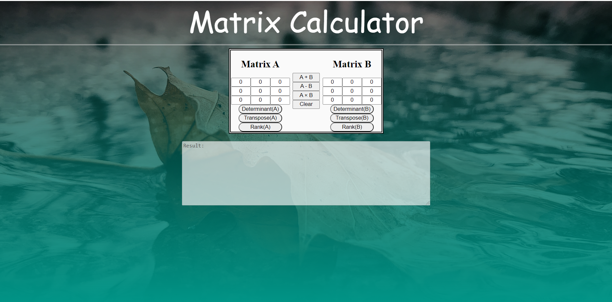

# Matrix Calculator
A javascript matrix calculator to find :

- Determinant of the matrix
- Transpose of the matrix
- Rank of the matrix

and also to perform basic operations such as :
- Addition
- Subtraction
- Multiplication




## Try it out
[https://unnatkr.github.io/Matrix-Calculator/](https://unnatkr.github.io/Matrix-Calculator/)

## Cloning this repository
```
$ git clone https://github.com/UnnatKr/Matrix-Calculator.git
```

## Technologies used:
* **HTML**
* **CSS**
* **Javascript**
## This project is Licensed under the MIT License
 [](LICENSE.txt)
