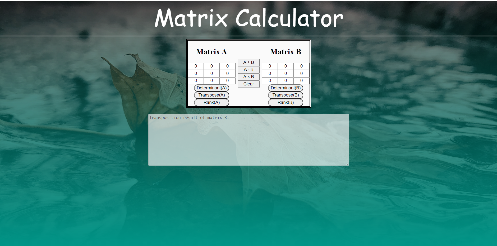

# Matrix Calculator
A javascript matrix calculator to find :

- Determinant of the matrix
- Transpose of the matrix
- Rank of the matrix

and also to perform basic operations such as :
- Addition
- Subtraction
- Multiplication

## Try it out

